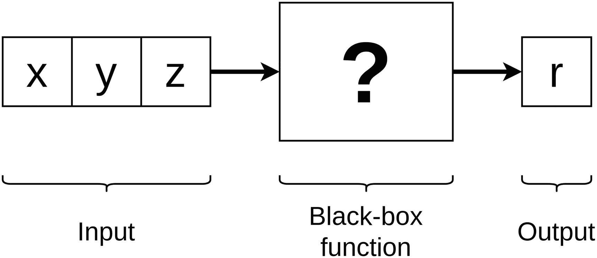
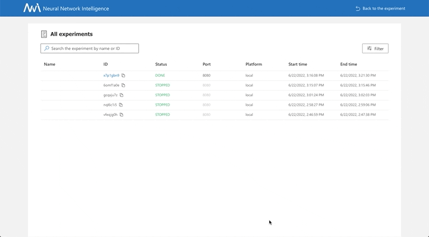

# Black-Box Function Optimization

Let’s examine how NNI works by optimizing a black-box function. A black-box function is a function that takes input parameters and returns a value, but we have no idea what is going on under the function’s hood. Sometimes, we know how a black-box function acts and, in some cases, even know its formula. But the nature of this function is so complicated that the analytical study is too challenging.



When we say that we need to optimize the black-box function, it means that we need to find such input parameters for which the black-box function outputs the highest value.

Let’s say that we have a black-box function, which is defined by the code:

```py
from math import sin, cos


def black_box_function(x, y, z):
    """
    x in [1, 100] integer
    y in [1, 10] integer
    z in [1, 10000] real
    """

    if y % 2 == 0:
        if x > 50:
            r = (pow(x, sin(z)) - x) * x / 2
        else:
            r = (pow(x, cos(z)) + x) * x
    else:
        r = pow(y, 2 - sin(x) * cos(z))
    return round(r / 100, 2)
```

Of course, the optimization problem for the function presented in Listing 1-2 can be solved analytically, but let’s pretend that we do not know how the function acts inside the black box. All we know is that the black-box function returns real value and receives the following input parameters:

- x positive integer from 1 to 100
- y positive integer from 1 to 10
- z float from 1 to 10 000

Let’s start solving our problem by defining a search space. Search space is defined in JSON format using special directives. We will define the search space using the following JSON file.

```json
{
  "x": {"_type": "quniform", "_value": [1, 100, 1]},
  "y": {"_type": "quniform", "_value": [1, 10, 1]},
  "z": {"_type": "quniform", "_value": [1, 10000, 0.01]}
}
```

`quniform` directive creates a value list from a to b with step s. So the search space can be presented the following way:
- x in [1, 2, 3, …, 99, 100]
- y in [1, 2, 3, …, 9, 10]
- z in [1, 1.01, 1.02, …, 9 999.99, 10 000]

Now let’s move on to the trial definition:

```py
import os
import sys
import nni

# For NNI use relative import for user-defined modules
SCRIPT_DIR = os.path.dirname(os.path.abspath(__file__))
sys.path.append(SCRIPT_DIR)

from bbf import black_box_function

if __name__ == '__main__':
    # parameter from the search space selected by tuner
    p = nni.get_next_parameter()
    x, y, z = p['x'], p['y'], p['z']
    r = black_box_function(x, y, z)
    # returning result to NNI
    nni.report_final_result(r)
```

Trial receives parameter from NNI using nni.get_next_parameter function and returns the metric using nni.report_final_result. Trial takes NNI parameters, passes them to the black-box function, and returns the result.

And the last thing left for us to do is to define the configuration of our experiment, which will look for the best input parameters for the black-box function:

```yml
trialConcurrency: 4
maxTrialNumber: 100
searchSpaceFile: search_space.json
trialCodeDirectory: .
trialCommand: python3 trial.py
tuner:
  name: Evolution
  classArgs:
      optimize_mode: maximize
trainingService:
  platform: local
```

The experiment that we have defined has the following properties:
1. Four-thread pool for trial execution.
1. The maximum number of trials is 1000.
1. Search space is defined in search_space.json.
1. Trial is executed by running python3 trial.py.
1. NNI will use a Tuner based on genetic algorithms.

Now let's create and run the experiment:

```sh
nnictl create --config ./config.yml
```

After completing the experiment, you can observe the parameter that returned the best metric:



