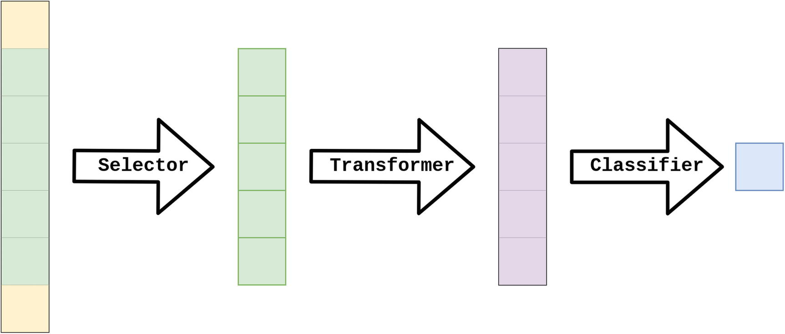
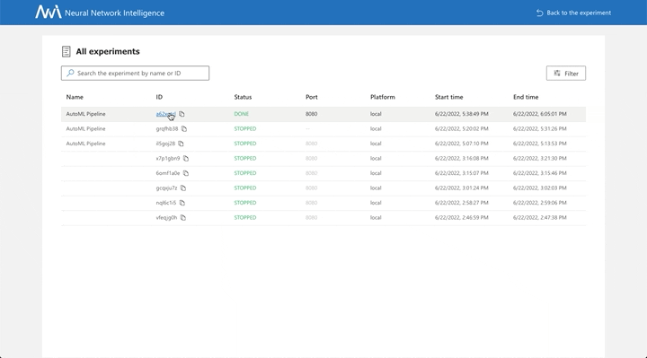

# Gamma Telescope Signal Classification

Gamma Telescope Dataset contains data of signals received by the telescope. The task is to discriminate signals caused by primary gammas (signal) from the images of hadronic showers initiated by cosmic rays in the upper atmosphere (background).

Perhaps the reader understands something in these physical data, but I do not understand anything about them. But that’s exactly what we need machine learning for – to find patterns and dependencies where we cannot see them ourselves.

## Operators

Now let’s define the functions that will make up the functional pipeline. We will call them Operators in the machine learning context. Machine learning operators for a classification problem can be separated into three types:
1. Selectors: Choose the most significant features (columns) from the dataset, removing dependent features. Usually reduces the input size. The selected features remain unchanged.
1. Transformers: Convert input according to some mathematical function without changing the input size.
1. Classifiers: Solve the classification problem itself.

Each operator has its own parameters, such as max_depth in the DecisionTreeClassifier.

## Experiment

